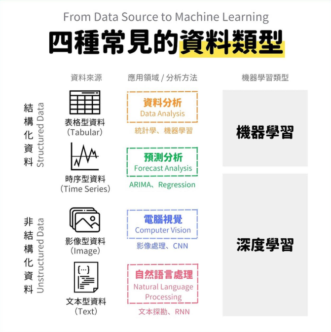

# infra-minio

MinIO is an object storage system released under GNU Affero General Public License v3.0. It is API compatible with the Amazon S3 cloud storage service. It is capable of working with unstructured data such as photos, videos, log files, backups.

MinIO 是一套物件儲存系統，可相容 AWS S3 API 系統，並提供非結構化資料存儲。


> from [資料科學中的四種常見資料型態 - ___dsdaily___](https://www.instagram.com/p/DJekN83Th8Q/?igsh=NG4wcTk4eWFpemR4)

對於資料科學中常見的結構化與非結構化資料，前者結構化資料存於資料庫並用於數據分析且多由，後者非結構化資料則用於影像處理、音訊處理、文本處理等。

過往對於這些非結構化資料的資料物件管理，會使用檔案伺服器處理，但 MinIO 除了提供資料物件管理外，也提供更多樣如用戶、加密等管理 API，並相容 AWS S3 雲端非結構化資料管理 API 系統，有利於開發自動化資料存儲流程。

### Startup

+ 啟動

使用 CLI 呼叫 docker-compose 來啟動相關服務

```
minio up
```
> 預設啟用 OSS 版本，若要使用企業版則添加參數 ```--ent```

+ 關閉

使用 CLI 呼叫 docker-compose 來關閉相關服務

```
minio down
```

+ 進入

使用 CLI 進入目標容器內來操作相關服務的命令

```
minio into --tag=[service-name]
```

### 服務部屬

對於 MinIO 服務拓譜部屬方式與差異，詳細文獻整理參閱 [Minio 部屬](./docs/minio-deploy.md)。

對於 MinIO 服務拓譜的核心設計概念，詳細文獻整理參閱 [Minio 核心概念](./docs/core-concept.md)。

### 客戶操作

對於 MinIO 客戶端 ( Client ) 操作說明，詳細文獻整理參閱 [Minio 客戶端](./docs/minio-client.md)。

### 用戶與群組

### 監控與告警

### 物件管理

### 加密

## 文獻

+ [MinIO](https://min.io/docs/minio/container/index.html)
    - [MinIO - Wiki](https://en.wikipedia.org/wiki/MinIO)
    - [MinIO - Docker](https://hub.docker.com/r/minio/minio/)
    - [MinIO Client - Docker](https://hub.docker.com/r/minio/mc)
+ Upload file Server
    - [Configure NGINX Proxy for MinIO Server](https://min.io/docs/minio/linux/integrations/setup-nginx-proxy-with-minio.html)
    - [Upload Files Using Pre-signed URLs](https://min.io/docs/minio/linux/integrations/presigned-put-upload-via-browser.html)
    - [Posting a File with Curl](https://reqbin.com/req/c-dot4w5a2/curl-post-file)
+ 說明與教學
    - [資料庫 - 大型物件儲存系統 MinIO 簡介](https://ambersun1234.github.io/database/database-minio/)
    - [幫非結構化資料找個家，快速入門MinIO(一)：基本概念介紹](https://medium.com/jimmyfu87/b9f7c830fd26)
